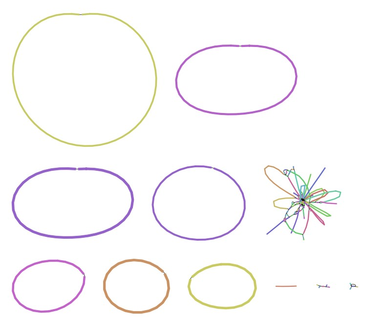

## Description

A metagenomic sample was sequenced using the nanopore platform. 

The assembly graph looks like this (Visualised using [bandage](https://rrwick.github.io/Bandage/)):



## Data availability

The sequencing data is stored on the LiSC server [https://fileshare.csb.univie.ac.at/JMF/public/2021-11-02_R10_4_LSK112_ZYMOHMW/](https://fileshare.csb.univie.ac.at/JMF/public/2021-11-02_R10_4_LSK112_ZYMOHMW/)

## Load packages

```{r loadlibraries,echo=TRUE,warning=FALSE,message=FALSE}
library(tidyverse)
library(Biostrings)
library(kableExtra)
options(scipen = 10)
```

## Load data

```{r loaddata,echo=TRUE,warning=FALSE,message=FALSE}
# Load assembly information
ASM_INFO<-read_tsv(file = "data/assembly_info.txt") %>%
  mutate(scaffold=`#seq_name`,
         coverage=cov.,
         circular=circ.) %>%
  select(scaffold,coverage,circular)

# Load assembly
assembly <- readDNAStringSet(filepath = "data/assembly.fa", format = "fasta")

# Calculate contig lengths and gc content
mm <- tibble(
    scaffold = as.character(names(assembly)),
    length = as.integer(width(assembly)),
    gc = round(as.numeric(letterFrequency(assembly, letters = c("CG"), as.prob = T)) * 100, digits = 2)
  ) %>%
  left_join(ASM_INFO)
```

## What does the data look like?

```{r showdata,echo=FALSE,warning=FALSE,message=FALSE}
head(mm) %>% 
  kbl(escape = F,digits = 2) %>%
  kable_paper("striped", full_width = F,position = "left")
```


## Plot metagenome coverage vs gc

* Multiple contigs were circular and above 1 Mbp.  Can you label them with the contig names in the plot?
* Can you extract the contig names for contigs with less than 100X coverage and identify what they are?
* Can you identify what the contig with the lowest GC content is and label it?
* Can you identify the 16S rRNA genes and create a plot where you color the contigs by species ID?

```{r plotdata,echo=FALSE,warning=FALSE,message=FALSE,fig.width=10,fig.width=10}
mm %>%
  ggplot(aes(x = gc,y = coverage,size=length,col=circular))+
  geom_point()+scale_y_log10()+
  scale_size_area(max_size = 20)
```


## Methods

The nanopore reads were assembled using flye (v. 2.8.3-b1695, [@kolmogorov2019assembly])

## Further reading

Check out the [mmgenome2](https://github.com/KasperSkytte/mmgenome2) package where a lot of this plotting and extraction of contig functionality is nicely wrapped.

## References

