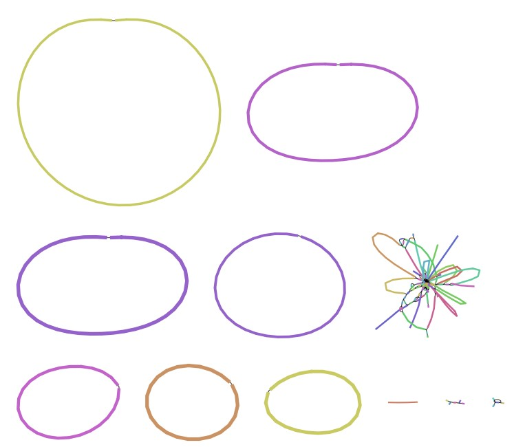
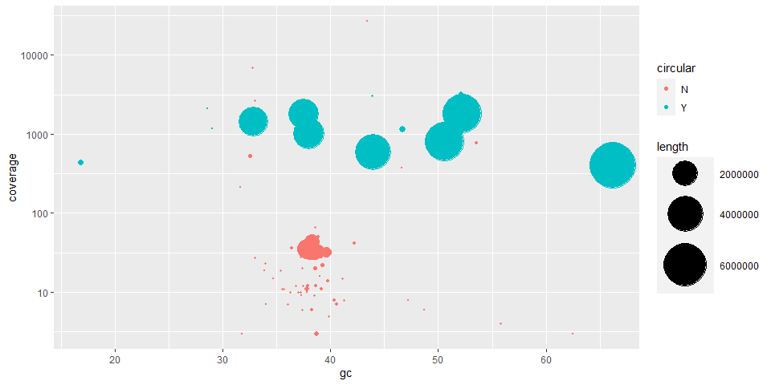

## Description

A metagenomic sample was sequenced using the nanopore platform.

The assembly graph looks like this (Visualised using
[bandage](https://rrwick.github.io/Bandage/)):



## Data availability

The sequencing data is stored on the LiSC server
<https://fileshare.csb.univie.ac.at/JMF/public/2021-11-02_R10_4_LSK112_ZYMOHMW/>

## Load packages

``` r
library(tidyverse)
library(Biostrings)
library(kableExtra)
options(scipen = 10)
```

## Load data

``` r
# Load assembly information
ASM_INFO<-read_tsv(file = "data/assembly_info.txt") %>%
  mutate(scaffold=`#seq_name`,
         coverage=cov.,
         circular=circ.) %>%
  select(scaffold,coverage,circular)

# Load assembly
assembly <- readDNAStringSet(filepath = "data/assembly.fa", format = "fasta")

# Calculate contig lengths and gc content
mm <- tibble(
    scaffold = as.character(names(assembly)),
    length = as.integer(width(assembly)),
    gc = round(as.numeric(letterFrequency(assembly, letters = c("CG"), as.prob = T)) * 100, digits = 2)
  ) %>%
  left_join(ASM_INFO)
```

## What does the data look like?

<table class=" lightable-paper lightable-striped" style="font-family: &quot;Arial Narrow&quot;, arial, helvetica, sans-serif; width: auto !important; ">
<thead>
<tr>
<th style="text-align:left;">
scaffold
</th>
<th style="text-align:right;">
length
</th>
<th style="text-align:right;">
gc
</th>
<th style="text-align:right;">
coverage
</th>
<th style="text-align:left;">
circular
</th>
</tr>
</thead>
<tbody>
<tr>
<td style="text-align:left;">
contig_100
</td>
<td style="text-align:right;">
203520
</td>
<td style="text-align:right;">
39.03
</td>
<td style="text-align:right;">
31
</td>
<td style="text-align:left;">
N
</td>
</tr>
<tr>
<td style="text-align:left;">
contig_101
</td>
<td style="text-align:right;">
908096
</td>
<td style="text-align:right;">
38.20
</td>
<td style="text-align:right;">
35
</td>
<td style="text-align:left;">
N
</td>
</tr>
<tr>
<td style="text-align:left;">
contig_106
</td>
<td style="text-align:right;">
6180
</td>
<td style="text-align:right;">
36.28
</td>
<td style="text-align:right;">
10
</td>
<td style="text-align:left;">
N
</td>
</tr>
<tr>
<td style="text-align:left;">
contig_107
</td>
<td style="text-align:right;">
7406
</td>
<td style="text-align:right;">
38.46
</td>
<td style="text-align:right;">
9
</td>
<td style="text-align:left;">
N
</td>
</tr>
<tr>
<td style="text-align:left;">
contig_108
</td>
<td style="text-align:right;">
508510
</td>
<td style="text-align:right;">
38.52
</td>
<td style="text-align:right;">
32
</td>
<td style="text-align:left;">
N
</td>
</tr>
<tr>
<td style="text-align:left;">
contig_113
</td>
<td style="text-align:right;">
16087
</td>
<td style="text-align:right;">
39.14
</td>
<td style="text-align:right;">
11
</td>
<td style="text-align:left;">
N
</td>
</tr>
</tbody>
</table>

## Plot metagenome coverage vs gc

-   Multiple contigs were circular and above 1 Mbp. Can you label them
    with the contig names in the plot?
-   Can you extract the contig names for contigs with less than 100X
    coverage and identify what they are?
-   Can you identify what the contig with the lowest GC content is and
    label it?
-   Can you identify the 16S rRNA genes and create a plot where you
    color the contigs by species ID?



## Methods

The nanopore reads were assembled using flye (v. 2.8.3-b1695,
(Kolmogorov et al. 2019))

## Further reading

Check out the [mmgenome2](https://github.com/KasperSkytte/mmgenome2)
package where a lot of this plotting and extraction of contig
functionality is nicely wrapped.

## References

<div id="refs" class="references csl-bib-body hanging-indent">

<div id="ref-kolmogorov2019assembly" class="csl-entry">

Kolmogorov, Mikhail, Jeffrey Yuan, Yu Lin, and Pavel A Pevzner. 2019.
“Assembly of Long, Error-Prone Reads Using Repeat Graphs.” *Nature
Biotechnology* 37 (5): 540–46.

</div>

</div>
